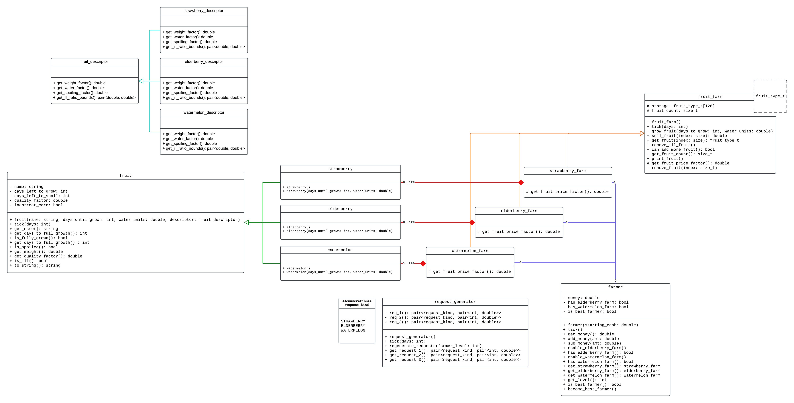

# Fruit Farm Sym

This is a university project to simulate a fruit farm.

# Premise

The idea behind this software is somewhat tied to that of a game.
You are a farmer who owns a farm of over-sized strawberries and must
sell them in order to progress.

You can own more farms and produce different fruits within each farm.
Every fruit, however, has a time to fully grow and a spoiling timer, which
means that you will have to manage your time in order to sell your fruit at
full price and avoid it becoming unsellable.

# Usage

This project is not meant to be a real simulation of an actual fruit
farm as it is a very stripped down version of one. It is meant to entertain.

Upon entering, you will be presented a menu of actions. Choose an action by
selecting the appropriate number. Each action may have submenus and others will
result in purchases and task fulfilment. Try it and farm away!

# UML Diagram



# Building

To build the project:

With CMake

```sh
mkdir build
cd build
cmake ..
make # or ninja, or whatever you use
```

Manually

```sh
clang++ src/*.cc
# or
g++ src/*.cc
```

# Disclaimers

From what I understand based on the assignment, some features from the C++
language along, with some entities from the standard library are forbidden. As
such, some of the present solutions may not be optimal (such as not employing
the use of `std::vector`, repetition of some code, etc.).


